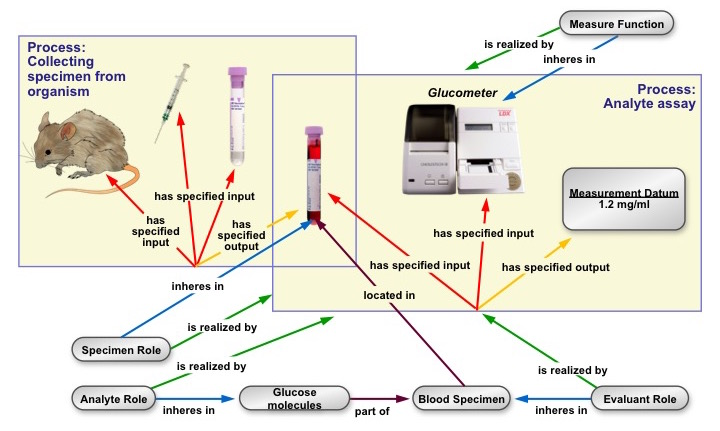

# Glucose Measurement Example

This document shows how we can represent a single blood serum glucose assay using OBI, according to figure below.

The list of ontology terms used in is [`glucose.tsv`](glucose.tsv). An [RDF Turtle](http://www.w3.org/TeamSubmission/turtle/) representation is in [`glucose.ttl`](glucose.ttl), and can viewed in [Protégé](http://protege.stanford.edu/). See the [issues list](issues) for problems with this representation.

First we have the material entities that persist through the whole measurement.

    mouse 1
      type: Mus musculus

    glucose molecules 1
      type: glucose
      part of: blood serum specimen 1

    syringe 1
      type: syringe

    test tube 1
      type: test tube

    glucometer 1
      type: glucometer

The glucometer has a measurement function, which we can also capture.

    glucometer measure function 1
      type: measure function
      inheres in: glucometer 1
      realized in: analyte assay 1

Before the assay can be performed, a blood serum specimen must be collected from the subject.

    collection process 1
      type: collecting specimen from organism
      has specified input: mouse 1
      has specified input: syringe 1
      has specified input: test tube 1
      has specified output: blood serum specimen 1

    blood serum specimen 1
      type: blood serum specimen
      contained in: test tube 1

The subject mouse and the blood serum specimen each have a specimen role that is realized in the collection process.

    specimen role 1
      inheres in: mouse 1
      realized in: collection process 1

    specimen role 2
      inheres in: blood serum specimen 1
      realized in: collection process 1

The assay process takes the blood serum specimen as input and creates a measurement datum as output.

    analyte assay 1
      type: analye assay
      has specified input: blood serum specimen 1
      has specified input: glucometer 1
      has specified output: measurement datum 1

    evaluant role 1
      type: evaluant role
      inheres in: blood serum specimen 1
      realized in: analyte assay 1

    analyte role 1
      type: analyte role
      inheres in: glucose molecules 1
      realized in: analyte assay 1

The measurement datum is linked to a scalar value specification, with the value and units of measure.

    measurement datum 1
      type: measurement datum
      has value specification: value specification 1

    value specification 1
      type: scalar value specification
      has specified value: "100"^^xsd:real
      has measurement unit label: mg/dl

